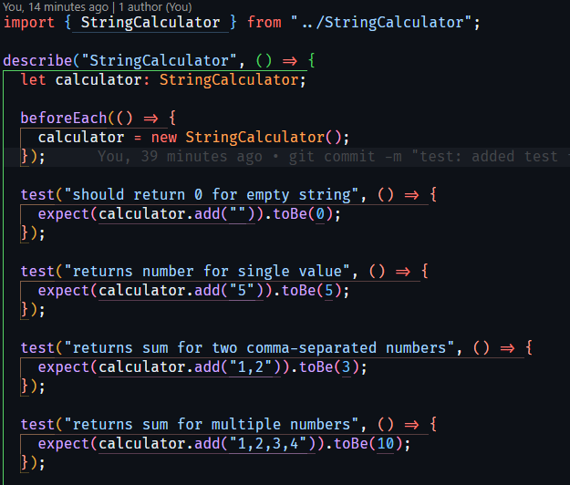
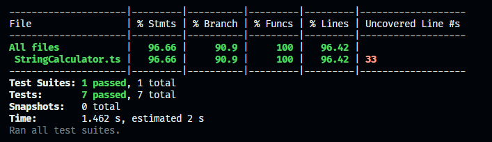
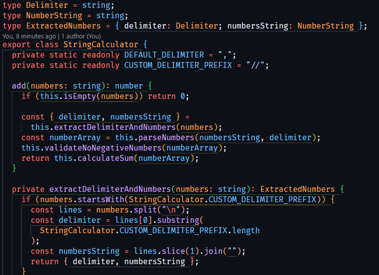
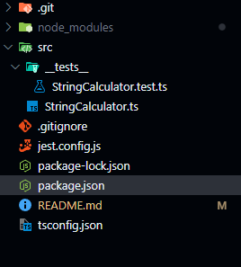

# String Calculator - TDD Kata

This is my implementation of the String Calculator kata using Test-Driven Development (TDD) in TypeScript.

## Current Implementation Status

### Completed Features  
- [X] Initial Project  
- [X] Empty string returns 0  
- [X] Single number returns the value  
- [X] Two numbers, comma delimited, returns the sum  
- [X] Two numbers, newline delimited, returns the sum  
- [X] Four numbers delimited either way returns the sum  
- [X] Negative numbers throw an exception  
- [X] Numbers greater than 1000 are ignored  
- [X] Single character delimiter can be defined on the first line  
- [X] Multi-character delimiter can be defined on the first line  
- [X] Many single or multi-char delimiters can be defined  

## Screenshots

### Test Output


---

### Test Coverage


---

### Code Example


---

### Project Structure


## Running Tests

```bash
# Run tests once
npm test

# Run tests in watch mode
npm run test:watch

# Generate coverage report
npm run test:coverage
```

## Development

1. Clone the repository
2. Install dependencies: `npm install`
3. Start development: `npm run dev`
4. Run tests: `npm test`
